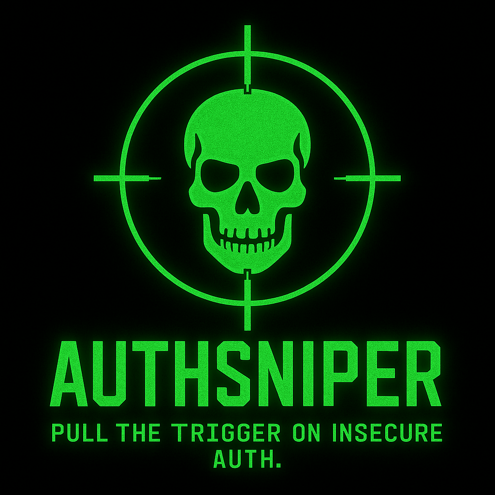

# AuthSniper

<p align="center">
  
</p>

<p align="center">
  <strong>Pull the trigger on insecure authentication.</strong><br>
  Lightweight offensive toolkit for auditing modern login systems, sessions, and JWT security.
</p>

<p align="center">
  
  
  
  
</p>

---

## 🚀 Features (v0.1)

### 🔑 Authentication Attacks
- Behavior-based rate-limit detection
- Weak password policy checks
- User enumeration via response anomalies

### 🍪 Session & Cookie Audit
- Flags missing cookie protections:
  - `Secure`
  - `HttpOnly`
  - `SameSite`
- Detects potential session fixation markers
- Inspect session lifetime behavior

### 🔐 JWT Security Analysis
- Detects **`alg=none`**
- Flags algorithm mismatch attacks
- Identifies missing `exp`, `nbf`, or `iat`
- Detects excessive token lifetime
- Highlights replayable tokens

### 🧠 Smart Behavior Heuristics
- Minimal traffic, no flood-style brute force
- Sensitive to response time deltas, error entropy & status transitions

### 📦 Tool Capabilities
- YAML based target config
- JSON structured output
- Installable as a CLI tool
- Works against testing targets like JuiceShop, DVWA, etc.

---

## 📦 Installation

### 🔧 Option 1: Developer Setup (Recommended)

```bash
git clone https://github.com/pr4tikr4y/authsniper.git
cd authsniper
python -m venv venv
source venv/bin/activate    # Windows: venv\Scripts\activate
pip install -e .


